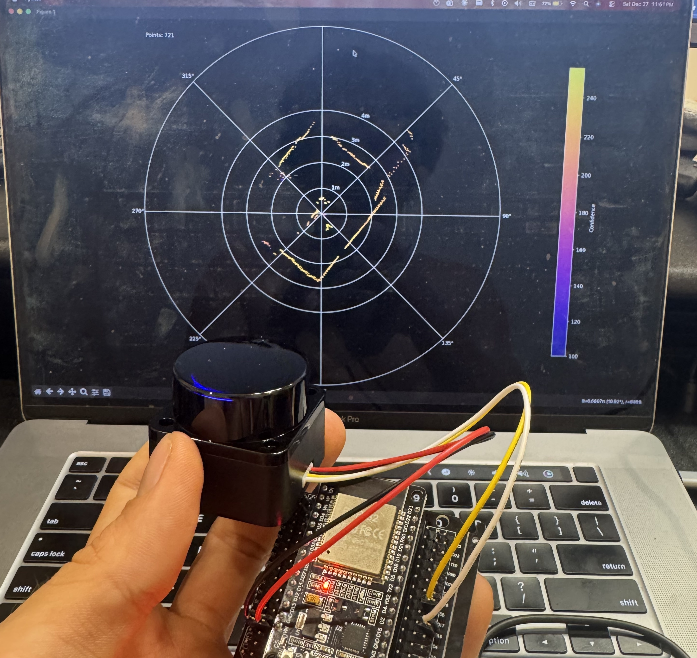
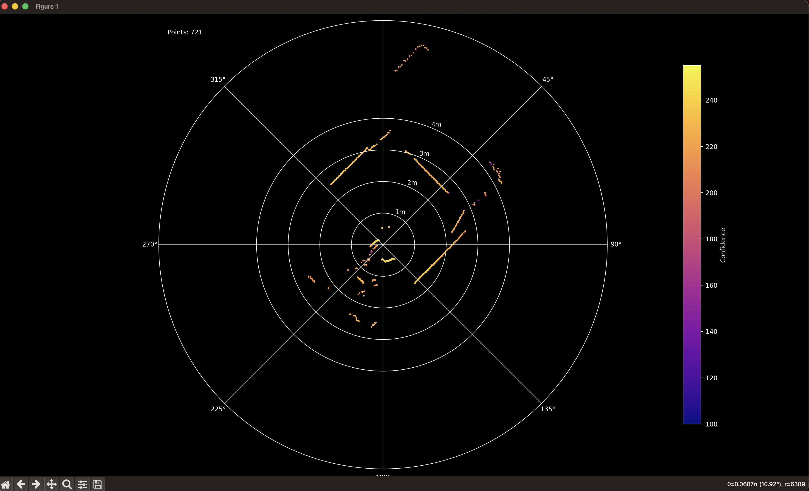

# LD06 LIDAR Interface

ESP32-based interface for the LD06 360-degree LIDAR sensor with real-time Python visualisation.

<table>
  <tr>
    <td></td>
    <td></td>
  </tr>
</table>

## Features

- ESP32 firmware parsing LD06 serial protocol with CRC validation
- PWM motor speed control via GPIO
- Real-time polar plot visualisation in Python
- Confidence-based point colouring

## Hardware

| Component | Pin |
|-----------|-----|
| LIDAR TX  | GPIO 16 (ESP32 RX) |
| LIDAR PWM | GPIO 5 |
| LIDAR VCC | 5V |
| LIDAR GND | GND |

## Installation

### ESP32 Firmware

Requires [PlatformIO](https://platformio.org/).

```bash
pio run --target upload
```

### Python Visualiser

```bash
pip install -r requirements.txt
python visualise.py
```

## Usage

1. Upload firmware to ESP32
2. Connect LD06 LIDAR as per hardware table
3. Run `python visualise.py`
4. Select the serial port when prompted

The visualiser displays a polar plot with:
- Distance shown radially (1m-4m rings)
- Confidence shown by colour (plasma colourmap)
- Auto-scaling for distant objects

## Serial Output Format

The ESP32 outputs CSV data at 921600 baud:

```
angle,distance,confidence
0.00,1234,200
0.50,1240,195
...
```

## Specifications

- **Range**: 0.02m - 8m
- **Scan Rate**: ~10Hz (360 degrees)
- **Angular Resolution**: 1 degree
- **Distance Resolution**: 1mm

## License

MIT
